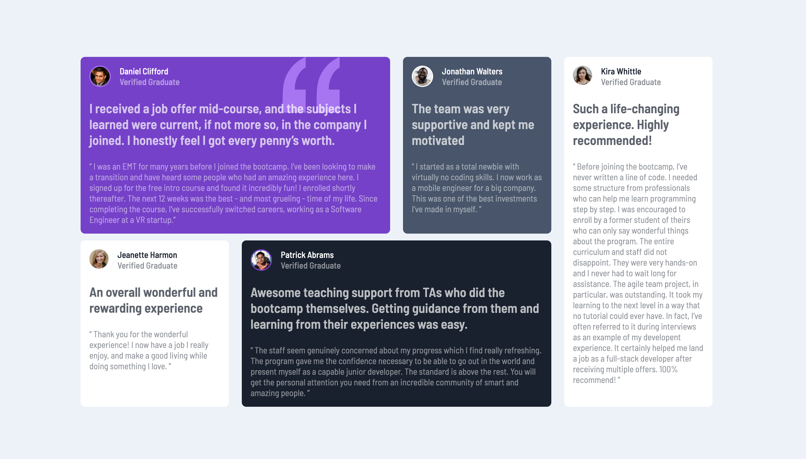

# Frontend Mentor - Testimonials grid section solution

This is a solution to the [Testimonials grid section challenge on Frontend Mentor](https://www.frontendmentor.io/challenges/testimonials-grid-section-Nnw6J7Un7). Frontend Mentor challenges help you improve your coding skills by building realistic projects.

## Table of contents

- [Overview](#overview)
  - [The challenge](#the-challenge)
  - [Screenshot](#screenshot)
  - [Links](#links)
- [My process](#my-process)
  - [Built with](#built-with)
  - [What I learned](#what-i-learned)
  - [Useful resources](#useful-resources)
- [Author](#author)

## Overview

### The challenge

Users should be able to:

- View the optimal layout for the site depending on their device's screen size

### Screenshot

### Links

- Solution URL: [Add solution URL here](https://your-solution-url.com)
- Live Site URL: [Add live site URL here](https://your-live-site-url.com)

## My process

### Built with

- Semantic HTML5
- CSS custom properties
- Flexbox
- CSS Grid

### What I learned

I have learned to use a CSS gridbox and adjust the layout according to the screen size

### Useful resources

- [Grid Generator](https://cssgrid-generator.netlify.app/) - This is an amazing application that let me create a custom gridbox

## Author

- Website - [YugandarNR](https://github.com/YugandarNR)
- Frontend Mentor - [@YugandarNR](https://www.frontendmentor.io/profile/YugandarNR)
